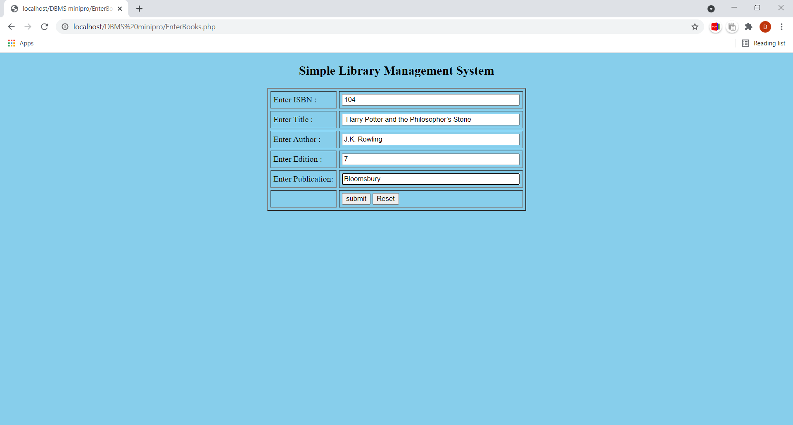
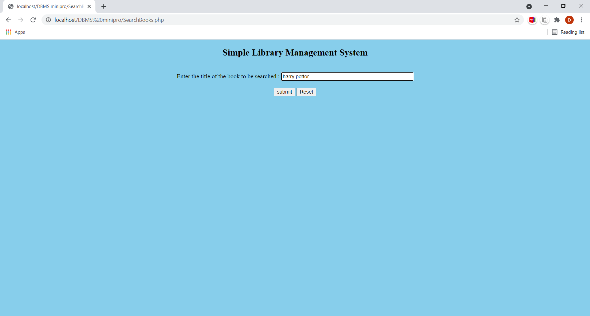
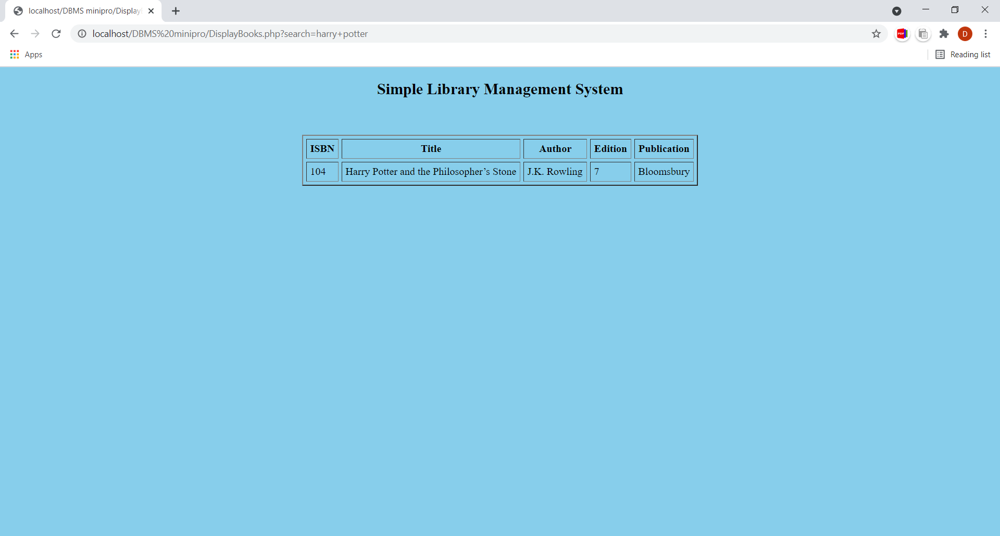

# library-management-system
Web base application for library management using mysql and php

This project is the prototype of a Simple Library Management System. Librarian has a provision to add book details like ISBN number, book title, author name, edition and publication details through the web page. In addition to this, librarian or any user has a provision to search for the available books in the library by the book name. If book details are present in the database, the search details are displayed on the web page.

This application is partitioned into 5 different files.

1.	To enter book details through an HTML web page – EnterBook.php
2.	To insert book details into the database – InsertBooks.php
3.	HTML web page to enter book name to be searched – SearchBooks.php
4.	PHP web page to display search results – DisplayBooks.php
5.	Database connection details – DBConnection.php

The project has been made using PHP, HTML and MySQL. It also uses MAMP application to run the code of php.

To create data base in MAMP application, open phpMyAdmin page and create a new database by running the following sql statement

CREATE TABLE book_info (isbn VARCHAR(30) PRIMARY KEY,title VARCHAR(100) NOT NULL,
author VARCHAR(100) NOT NULL,edition VARCHAR(30) NOT NULL,publication VARCHAR(30) NOT NULL);

Data base description:

The book_info data base contains following attributes 
1.	isbn = varchar(30)
2.	title =  varchar(100)
3.	author= varchar(100)
4.	edition= varchar(30)
5.	publication= varchar(30)

## sample screenshots

